# Congressional Trade Intelligence

A Python-based quantitative research platform that scrapes, scores, and analyses congressional stock trades to identify politicians whose trading behaviour shows statistically significant informational edge.

Built as an independent research project to explore whether political access and committee membership translate into measurable trading advantage — and to test whether that advantage is tradeable.

---

## Overview

Members of Congress are required to publicly disclose stock trades within 45 days of execution under the STOCK Act. This platform automates the collection and analysis of those disclosures, simulates a systematic trading strategy on each politician's disclosed buys, and scores them on the quality of their trading signal.

The core question: **after controlling for noise, do some politicians trade with consistent, non-random edge — and can it be systematically exploited?**

**Current scale:** ~45,000 trades across 229 politicians, 2015–2026.

---

## Screenshots

### Dashboard Overview
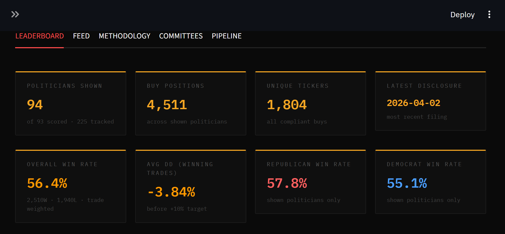

### Leaderboard
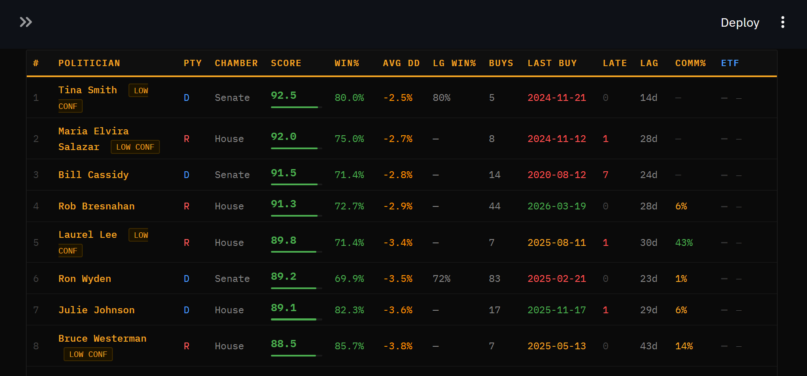

### Politician Profile
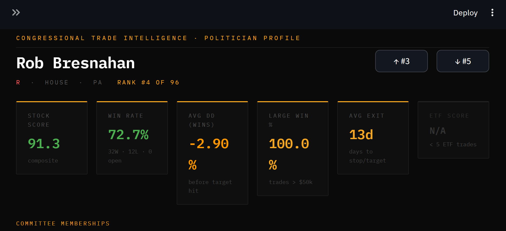
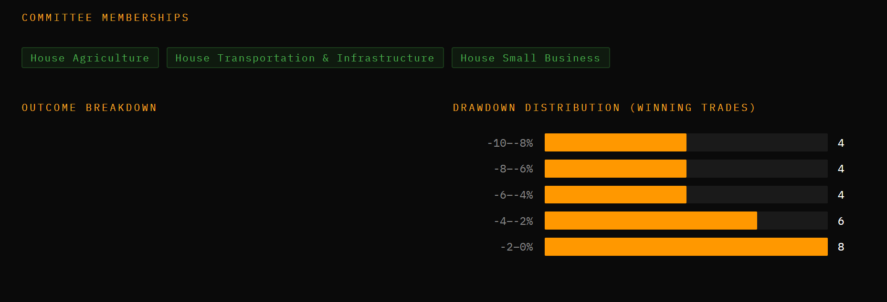
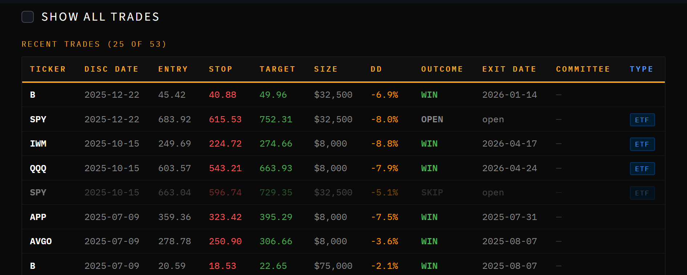

### Pipeline — Scoring Filter Funnel
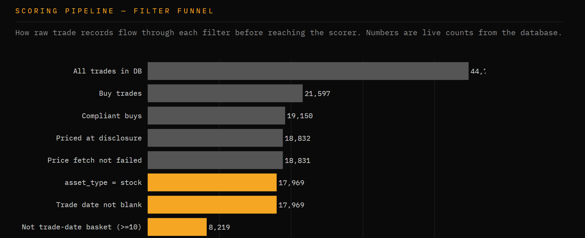
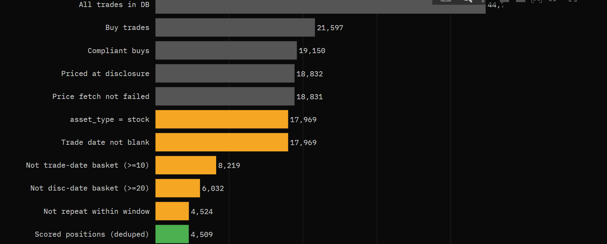
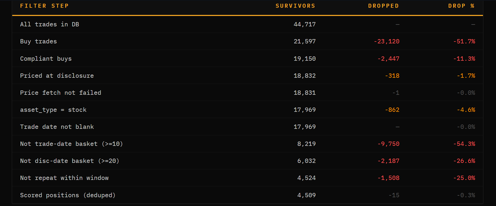

### Pipeline — Coverage Stats
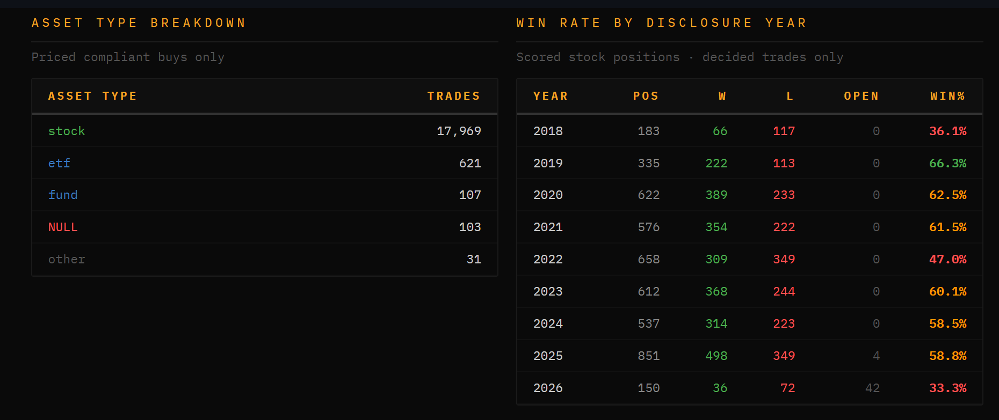

---

## How It Works

The platform runs as a multi-stage pipeline:

```
Capitol Trades (web) + FMP API
        │
        ▼
1. Scraper          — Selenium scraper + FMP API client collect disclosures, store to SQLite
        │
        ▼
2. Price Fetcher    — yfinance fetches entry prices + OHLC paths per trade
        │
        ▼
3. Data Enrichment  — asset type, sector/industry, market context features, cluster counts
        │
        ▼
4. Drawdown Calc    — simulates 10% stop / 10% target on OHLC paths from day-1 open
        │
        ▼
5. Scorer           — composite 0–100 score per politician
        │
        ▼
6. Dashboard        — interactive Streamlit dashboard
```

A daily runner (`runner/daily_runner.py`) chains steps 1–5 automatically.

---

## Scoring Methodology

### Strategy
Each buy trade is simulated from **disclosure date** (the first point a public follower could act), entering at the **day-1 market open** (MOO). A **10% stop-loss / 10% profit target** is applied to daily OHLC data, producing a WIN, LOSS, or OPEN outcome per trade.

Using disclosure date rather than trade date is deliberate — it measures the signal available to the public, not the politician's private timing advantage.

### Composite Score (0–100)

*The composite score is used for dashboard visualisation — ranking and comparing politicians at a glance. It is not the basis for the trade filter described in the Research Findings section, which operates at the individual trade level.*

| Component | Weight | Description |
|---|---|---|
| Win Rate | 50% | Normalised: 50% = 0 pts, 70%+ = 100 pts |
| Drawdown Profile | 30% | Avg max drawdown on winning trades before target hit |
| Large Trade Accuracy | 20% | Win rate on trades ≥ $50k (redistributed if < 5 large trades) |

### Data Quality Filters
Several filters are applied before scoring to remove noise:

- **Compliant buys only** — STOCK Act violations excluded
- **Price required** — trades with no fetched entry price excluded
- **Trade date required** — blank trade dates indicate poorly-filed disclosures
- **Trade-date cluster filter** — if a politician buys ≥10 distinct tickers on a single day, that day is excluded (portfolio rebalancing, not informed trading)
- **Disclosure-date cluster filter** — if ≥20 distinct tickers appear in a single filing event, that event is excluded (bulk portfolio dumps)
- **Asset type split** — stocks and ETFs scored separately

### Deduplication
Where multiple rows exist for the same politician + ticker + disclosure date + price (common due to amended filings), these are collapsed to a single scored trade via `GROUP BY`.

---

## Committee Alignment

Each politician's committee memberships are mapped against a custom sub-sector taxonomy (~35 categories) to flag trades where their committee access is relevant to the traded company.

For example, a member of the House Intelligence Committee buying a defence/surveillance contractor, or an Agriculture Committee member buying an agribusiness stock, is flagged as committee-relevant.

**Important caveat:** Committee alignment is currently only active for the 119th Congress (current). Historical trades by politicians who have since changed committees, or who are no longer serving, will not have a committee relevance flag. The feature is useful for assessing current members on the dashboard but should not be treated as a historically accurate point-in-time signal.

Committee data sources:
- House Clerk PDF (March 2026) — 119th Congress, high confidence
- Senate.gov live scraper — current 119th Congress assignments

---

## Research Findings

### ML Investigation — Shelved

An XGBoost model was trained on ~14,600 resolved stock buy trades using a 57-feature set covering trade-level signals (cluster count, pre-disclosure price move, size, sector), politician-level point-in-time features (historical win rate, filing lag, repeat-buy patterns), and market context (VIX, SPY momentum, sector ETFs).

**Key finding: the model is macro-dominated.** The top feature by a large margin was `spy_above_200ma` — a market regime indicator. Congressional trade-specific signals were buried. Out-of-sample AUC declined year-on-year, reaching 0.538 in 2025 (barely above random). This likely reflects the signal being priced in faster as congressional trading has attracted more public attention post-2021.

Decision: **ML shelved as a primary decision tool.** A simple interpretable filter was derived from confirmed edges instead.

---

### Filter Analysis — Two Signals That Multiply

Two independent signals showed consistent, robust edge on the full historical population (n=20,268 decided stock buys, baseline WR 60.3%):

**Signal 1 — Trade-date cluster count (`cluster_count_td`)**  
Multiple politicians independently buying the same stock on the same trade date. They cannot have coordinated — this is genuine convergent conviction.

| Threshold | n | Win Rate |
|---|---|---|
| Baseline | 20,268 | 60.3% |
| cluster ≥ 2 | 1,859 | 62.2% |
| cluster ≥ 3 | 894 | 66.1% |
| cluster ≥ 4 | 455 | 68.1% |

**Signal 2 — Pre-disclosure price move (`abs_pct_move_before_disclosure ≥ 15%`)**  
The stock moved more than 15% in either direction between the politician's trade date and public disclosure. Contrary to intuition, this does *not* mean the trade is "too late" — the MOO entry is at disclosure, and the data suggests the move has further to go.

Standalone: 60.1% WR (+2.9pp above baseline). Useful only in combination.

**The key finding: the signals multiply.**

| Filter | n | Win Rate |
|---|---|---|
| cluster ≥ 3 alone | 894 | 66.1% |
| abs_move ≥ 15% alone | ~4,500 | 60.1% |
| **cluster ≥ 3 + abs_move ≥ 15%** | **181** | **77.9%** |
| cluster ≥ 2 + abs_move ≥ 15% | 304 | 74.7% |

When several politicians independently buy the same name at a point of significant price movement, the two signals identify the same underlying phenomenon from different angles — which is why they compound rather than overlap.

---

### Equity Curves vs SPY Buy-and-Hold

Setup: $100k account, 1% position size per trade (compounded), 10% stop / 10% target, MOO entry. SPY buy-and-hold shown as benchmark (fully invested from first filter trade date, 2020-03-16).

#### cluster ≥ 3 + abs_move ≥ 15% (primary filter, n=181, WR 77.9%)

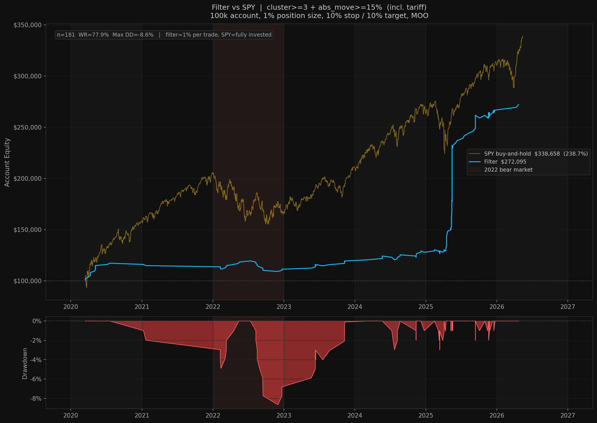

**Filter: $272k | SPY: $339k**

SPY wins on absolute return. Each trade is sized at 1% of capital — the strategy is never near fully invested. The relevant comparison is **risk-adjusted**: filter max drawdown was **8.6%** vs SPY's ~34% peak-to-trough in 2022. The filter never went below starting capital.

---

#### cluster ≥ 2 + abs_move ≥ 15% (looser variant, n=304, WR 74.7%)

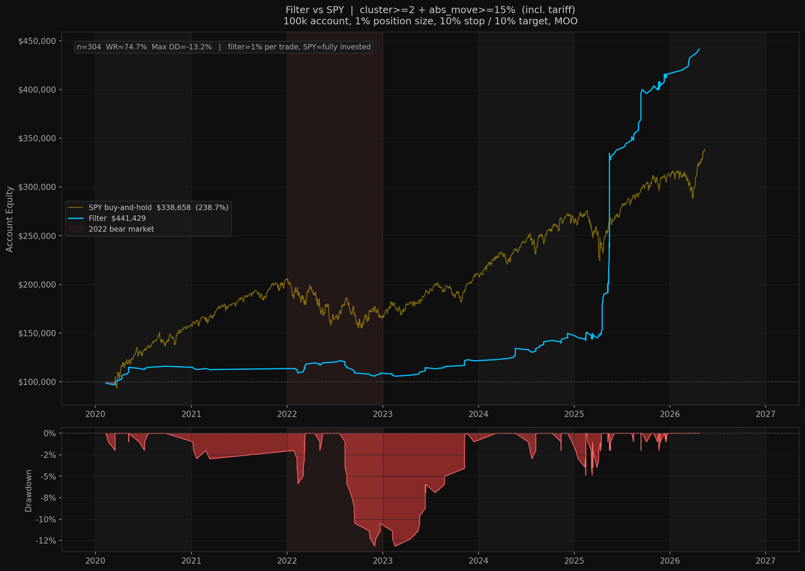

**Filter: $441k | SPY: $339k**

The looser variant beats SPY on absolute return — driven primarily by the 2025 tariff crash (Liberation Day, April 2025), where 70 of 110 filter hits that year came from a single macro event at ~93% WR. The V-shaped recovery was captured almost perfectly.

---

### Honest Assessment

#### Year-by-year results (cluster ≥ 3)

| Year | Trades | Win Rate | Notes |
|---|---|---|---|
| 2020 | 16 | 100.0% | COVID V-shaped recovery |
| 2021 | 2 | 0.0% | Too small to read |
| 2022 | 21 | 42.9% | **Below baseline** — sustained bear market |
| 2023 | 11 | 81.8% | Normal market |
| 2024 | 19 | 68.4% | Normal market |
| 2025 | 110 | 83.6% | Tariff crash (see below) |

#### The 2025 tariff event

2025 dominates the sample — 110 of 181 total cluster≥3 filter hits (61%) came in a single year. The driver was Liberation Day (April 2, 2025): a sweeping tariff announcement triggered a sharp market sell-off, and politicians bought aggressively during the drawdown. Those trades were disclosed in April–May as the market recovered.

| Trade date | n | Win Rate |
|---|---|---|
| March 2025 | 17 | 94.1% |
| April 2025 | 53 | 92.5% |
| Rest of 2025 | 40 | ~67% |

70 of 110 (64%) 2025 filter hits came from this window at ~93% WR. The remaining 40 non-tariff 2025 trades showed ~67% WR — still above baseline, but not exceptional. The V-shaped recovery was captured almost perfectly by the filter; the signal fired at maximum intensity exactly when it mattered most.

The 77.9% headline WR is real, but it is substantially inflated by this single macro event. Stripping it out, the ex-tariff filter runs at 68.5% WR on 111 trades.

#### What the filter doesn't do

- **Fails in sustained bear markets.** 2022 saw a 9-trade losing streak spread over 4 months (Aug–Dec) — a rate-hike grind with no V-shaped recovery. The filter kept firing; stocks kept falling.
- **Doesn't beat passive SPY on absolute return** (cluster≥3 variant). Each trade is sized at 1% of capital — trades can overlap but the strategy is never near fully invested. Comparing absolute return with a fully-invested index isn't apples-to-apples.
- **Low frequency in normal years.** 11–32 trades per year (~1–2/month). Not a primary strategy; a selective overlay.

#### What it does do

The relevant edge is **risk-adjusted**: max drawdown 8.6% (cluster≥3) vs SPY's ~34% in 2022. The filter never went below starting capital in any scenario. In normal markets (2023–2024) it runs at 68–82% WR on 11–32 trades per year — a positive, selective signal with a much better drawdown profile than passive exposure.

**Bottom line:** The filter appears best understood as a tool for capturing V-shaped recoveries. When markets sell off sharply and recover fast, multiple politicians tend to buy the same names during the dip — the cluster and abs_move signals fire together at exactly that moment, and the recovery is captured from MOO entry at disclosure. This is why COVID 2020 and the 2025 tariff crash produced the strongest results. 2022 is the cautionary case: the filter kept firing, but without a V-shaped recovery there was nothing to capture — a sustained rate-hike grind that the signal cannot anticipate or avoid.

---

## Tech Stack

| Tool | Purpose |
|---|---|
| Python | Core language |
| Selenium | Web scraping (Capitol Trades) |
| yfinance | Price data + OHLC paths |
| SQLite | Local database (~45k trades) |
| Pandas | Data processing |
| Streamlit | Interactive dashboard |
| XGBoost | ML model training and evaluation |
| Matplotlib | Equity curves and analysis charts |
| FMP API | Congressional trade data (supplementary source) |
| SEC EDGAR API | SIC codes for sector classification |

---

## Project Structure

```
congressional_trading/
├── scrapers/
│   ├── capitol_trades.py              # Selenium scraper (Capitol Trades)
│   ├── fmp_fetcher.py                 # FMP API client (congressional disclosures)
│   └── senate_assignments_scraper.py  # Senate.gov committee assignments
├── pipeline/
│   ├── extend_price_paths.py          # Extends OHLC paths to current date
│   ├── drawdown_calculator.py         # Simulates stop/target on OHLC paths
│   ├── scorer.py                      # Composite scoring logic
│   ├── sector_fetcher.py              # Sector/industry + committee relevance flags
│   ├── asset_type_fetcher.py          # Stock vs ETF vs fund classification
│   ├── market_features.py             # Market context features (VIX, SPY, sector ETFs)
│   ├── repeat_buy_features.py         # Repeat/routine buy feature engineering
│   ├── repeat_buy_flagger.py          # Within-window repeat buy detection
│   ├── politician_features.py         # Point-in-time politician-level features
│   ├── trade_date_prices.py           # Trade-date price + pre-disclosure move backfill
│   ├── cluster_count.py               # Trade-date cluster count calculation
│   └── rebuild_all_paths.py           # Full OHLC path rebuild utility
├── setup/                             # One-time committee data setup scripts
│   ├── committee_loader.py            # Loads committee memberships into DB
│   ├── clerk_committee_parser.py      # House Clerk XML parser (116th–119th Congress)
│   ├── mit_committee_parser.py        # MIT political data committee parser
│   ├── senate_119_parser.py           # Senate 119th Congress parser
│   └── parse_clerk_pdf.py             # Clerk PDF committee parser (March 2026)
├── runner/
│   └── daily_runner.py                # Chains full pipeline (scrape → score)
├── dashboard/
│   └── app.py                         # Streamlit dashboard
├── execution/
│   └── rules.md                       # Trading rules and execution methodology
├── archive/                           # Deprecated scripts (kept for reference)
└── data/
    └── trades.db                      # SQLite database (not included in repo)
```

---

## Database

The SQLite database is not included in this repository (size + data sourcing). Key tables:

- **trades** — ~45,000 rows. Disclosure metadata, prices, returns, sector, committee flags, ML features
- **politicians** — 229 tracked, 94 scored. Composite scores, win rates, trade counts
- **trade_price_paths** — ~9M rows. Daily OHLC paths per trade for simulation
- **committee_memberships** — ~19,000 rows. Historical memberships across multiple congresses
- **market_features** — Daily market context (VIX, SPY, sector ETFs) joined at trade date

---

## Status

**Research phase complete.**

- [x] Data collection pipeline (Capitol Trades scraper + FMP API)
- [x] Price fetching and OHLC simulation
- [x] Composite politician scoring system
- [x] Interactive Streamlit dashboard
- [x] ML investigation (XGBoost — built, evaluated, shelved: macro-dominated)
- [x] Filter analysis complete — `cluster≥3 + abs_move≥15%` confirmed edge
- [x] Equity curve and risk analysis vs SPY benchmark

---

## Data Sources

| Source | Data |
|---|---|
| [Capitol Trades](https://www.capitoltrades.com) | Congressional trade disclosures |
| [Financial Modeling Prep](https://financialmodelingprep.com) | Supplementary congressional disclosure data |
| [yfinance](https://github.com/ranaroussi/yfinance) | Stock price data + OHLC paths |
| [SEC EDGAR](https://www.sec.gov/cgi-bin/browse-edgar) | SIC codes for sector classification |
| US House Clerk | Committee membership XML snapshots (116th–119th Congress) |
| [Senate.gov](https://www.senate.gov) | Current 119th Congress committee assignments |

---

*Independent research project. Built with Claude (Anthropic) as a development assistant. Architecture, analysis, and domain logic by the author. Not financial advice.*
