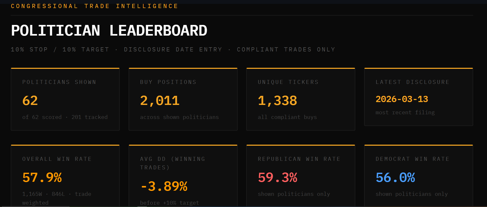
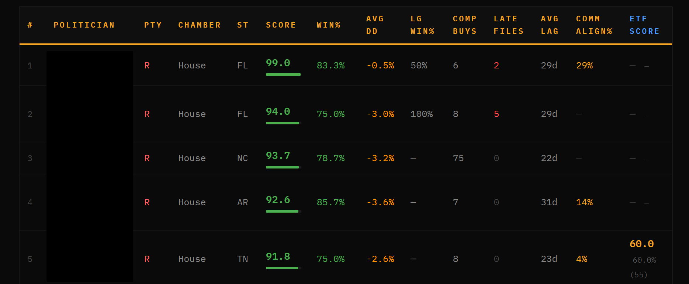
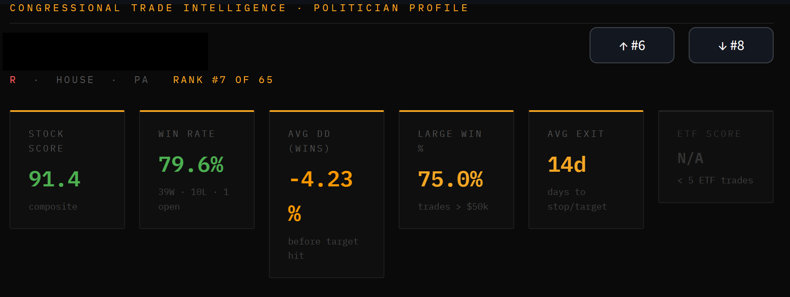

# Congressional Trade Intelligence

A Python-based quantitative research platform that scrapes, scores, and analyses congressional stock trades to identify politicians whose trading behaviour shows statistically significant informational edge.

Built as an independent research project to explore whether political access and committee membership translate into measurable trading advantage.

---

## Overview

Members of Congress are required to publicly disclose stock trades within 45 days of execution under the STOCK Act. This platform automates the collection and analysis of those disclosures, simulates a systematic trading strategy on each politician's disclosed buys, and scores them on the quality of their trading signal.

The core question: **after controlling for noise, do some politicians trade with consistent, non-random edge?**

---

## Screenshots

### Leaderboard


### Leaderboard Table


### Politician Profile


---

## How It Works

The platform runs as a multi-stage pipeline:

```
Capitol Trades (web)
        │
        ▼
1. Scraper          — Selenium scraper collects disclosures, stores to SQLite
        │
        ▼
2. Price Fetcher    — yfinance fetches entry prices + OHLC paths per trade
        │
        ▼
3. Data Enrichment  — asset type, sector/industry, SIC codes, committee memberships
        │
        ▼
4. Drawdown Calc    — calculates max drawdown per trade from OHLC path data
        │
        ▼
5. Scorer           — composite 0-100 score per politician
        │
        ▼
6. Dashboard        — interactive Streamlit dashboard
```

A daily runner (`runner/daily_runner.py`) chains steps 1–5 automatically.

---

## Scoring Methodology

### Strategy
Each buy trade is simulated from **disclosure date** (the first point a public follower could act) using a **10% stop-loss / 10% profit target** strategy applied to daily OHLC data. This produces a WIN, LOSS, or OPEN outcome per trade.

Using disclosure date rather than trade date is deliberate — it measures the signal available to the public, not the politician's private timing advantage.

### Composite Score (0–100)
| Component | Weight | Description |
|---|---|---|
| Win Rate | 50% | Normalised: 50% = 0 pts, 70%+ = 100 pts |
| Drawdown Profile | 30% | Avg max drawdown on winning trades before target hit |
| Large Trade Accuracy | 20% | Win rate on trades ≥ $50k (redistributed if < 5 large trades) |

### Data Quality Filters
Several filters are applied before scoring to remove noise and ensure only genuine trading signals are counted:

- **Compliant buys only** — STOCK Act violations excluded
- **Price required** — trades with no fetched entry price excluded
- **Trade date required** — blank trade dates indicate poorly-filed disclosures
- **Trade-date cluster filter** — if a politician buys ≥10 distinct tickers on a single day, that day is excluded (portfolio rebalancing, not informed trading)
- **Disclosure-date cluster filter** — if ≥20 distinct tickers appear in a single filing event, that event is excluded (bulk portfolio dumps)
- **Asset type split** — stocks and ETFs scored separately; ETF win rates cannot reflect insider knowledge on individual stocks

### Deduplication
Where multiple rows exist for the same politician + ticker + disclosure date + price (common due to amended filings), these are collapsed to a single scored trade via `GROUP BY`.

---

## Committee Alignment

Each politician's committee memberships are mapped against a custom sub-sector taxonomy (~35 categories) to flag trades where their committee access is relevant to the traded company.

For example, a member of the House Intelligence Committee buying a defence/surveillance contractor, or an Agriculture Committee member buying an agribusiness stock, is flagged as committee-relevant.

This produces a **Committee Alignment %** per politician, visible on the leaderboard and per-trade profile.

Committee data sources:
- House Clerk XML snapshots (116th–119th Congress)
- Senate.gov live scraper (current 119th Congress)
- Official Clerk House PDF (March 2026)

---

## Tech Stack

| Tool | Purpose |
|---|---|
| Python | Core language |
| Selenium | Web scraping (Capitol Trades) |
| yfinance | Price data + OHLC paths |
| SQLite | Local database (~35k trades) |
| Pandas | Data processing |
| Streamlit | Interactive dashboard |
| SEC EDGAR API | SIC codes for sector classification |

---

## Project Structure

```
congressional_trading/
├── scrapers/
│   ├── capitol_trades.py       # Selenium scraper (Capitol Trades)
│   └── senate_assignments_scraper.py  # Senate.gov committee assignments scraper
├── pipeline/
│   ├── price_fetcher.py        # Entry prices + forward returns
│   ├── extend_price_paths.py   # Extends OHLC paths to current date
│   ├── drawdown_calculator.py  # Simulates stop/target on OHLC paths
│   ├── scorer.py               # Composite scoring logic
│   ├── sector_fetcher.py       # Sector/industry + committee relevance flags
│   ├── asset_type_fetcher.py   # Stock vs ETF vs fund classification
│   ├── committee_loader.py     # Loads committee memberships into DB
│   ├── committee_config.py     # Taxonomy: subsectors, committee→sector map
│   └── sic_fetcher.py          # SIC codes from SEC EDGAR
├── dashboard/
│   └── app.py                  # Streamlit dashboard
├── runner/
│   └── daily_runner.py         # Chains full pipeline (scrape → score)
└── data/
    └── trades.db               # SQLite database (not included in repo)
```

---

## Database

The SQLite database is not included in this repository (size + data sourcing). Key tables:

- **trades** — ~35,000 rows. Disclosure metadata, prices, returns, sector, committee flags
- **politicians** — 200+ tracked. Composite scores, win rates, trade counts
- **trade_price_paths** — ~6M rows. Daily OHLC paths per trade for simulation
- **committee_memberships** — ~19,000 rows. Historical memberships 1993–present
- **committees** — Committee metadata and sector jurisdiction mapping

---

## Status

**Active development.** Current focus:

- [ ] Random Forest classification model — predicts trade outcome probability at disclosure date using a strictly point-in-time feature set (politician-level: historical win rate, filing lag, committee membership; trade-level: size, sector, committee alignment, pre-disclosure price move)
- [ ] Ticker concentration filter
- [ ] Committee signal refinement

---

## Data Sources

| Source | Data |
|---|---|
| [Capitol Trades](https://www.capitoltrades.com) | Congressional trade disclosures |
| [yfinance](https://github.com/ranaroussi/yfinance) | Stock price data + OHLC paths |
| [SEC EDGAR](https://www.sec.gov/cgi-bin/browse-edgar) | SIC codes for sector classification |
| US House Clerk | Committee membership XML snapshots (116th–119th Congress) |
| [Senate.gov](https://www.senate.gov) | Current 119th Congress committee assignments |
| [Congress.gov API](https://api.congress.gov) | Planned: terms served, additional member metadata |

---

*Independent research project. Built with AI-assisted development. Architecture, analysis, and domain logic by the author. Not financial advice.*
